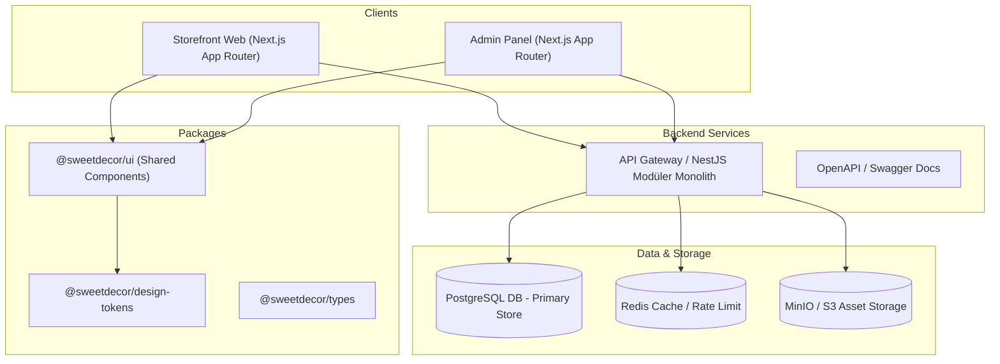
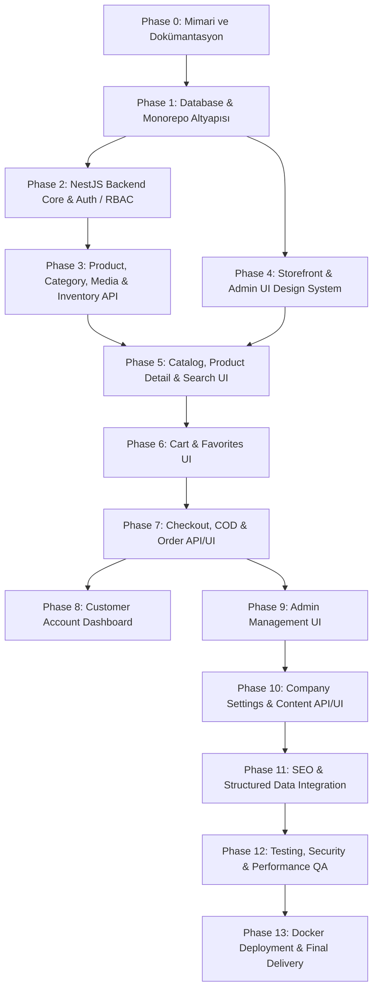

# ARCHITECTURE SPECIFICATION — Sweet Decor / Birlik Pastacılık

## 1. Executive Summary
Birlik Pastacılık / Sweet Decor, pasta malzemeleri ve dekorasyon aksesuarlarının satışı için tasarlanmış high-fidelity, production-ready, SEO ve performans odaklı bir e-ticaret platformudur.

Platform iki ayrı Next.js ön yüz uygulamasından (Storefront ve Admin Panel) ve bir NestJS REST API modüler monolith arka yüz uygulamasından oluşur.

---

## 2. High-Level Architecture Diagram (Mermaid)



---

## 3. Tech Stack Decision Matrix

| Katman | Teknoloji | Seçim Gerekçesi |
|---|---|---|
| **Monorepo Manager** | Turborepo + pnpm workspaces | Hızlı build önbellekleme, bağımlılık paylaşımı ve modüler mimari yönetimi. |
| **Storefront** | Next.js (App Router, TS, Tailwind CSS) | SSR/SSG ile mükemmel SEO performansı, hızlı sayfa yükleme ve kolay hydration. |
| **Admin Panel** | Next.js (App Router, TS, Tailwind CSS) | Storefront ile aynı UI primitive bileşenlerini ve tasarım sistemini paylaşma imkanı. |
| **Design System** | `@sweetdecor/ui` + `@sweetdecor/design-tokens` | Stitch tasarım arşivindeki CSS token'larını ve tipografiyi %100 sadakatle koruma. |
| **Backend API** | NestJS (TypeScript, RESTful, OpenAPI) | Kurumsal seviyede modüler mimari, güçlü DTO validation (class-validator) ve DI. |
| **Database & ORM** | PostgreSQL + Prisma ORM | Güçlü ilişkisel veri modeli, tip güvenliği, güvenilir migration ve snapshot yönetimi. |
| **Cache & Queue** | Redis | Rate-limiting, hızlı oturum ve ürün önbellekleme altyapısı. |
| **File Storage** | MinIO (Local) / AWS S3 Abstraction | Görsellerin veritabanı dışında optimize varyantlar (thumb, medium, original) olarak saklanması. |
| **Ödeme Yöntemi** | Cash on Delivery (Kapıda Ödeme) | İleride Iyzico/PayTR/Stripe eklenebilecek genişletilebilir `PaymentMethod` abstraction'ı. |
| **Containerization** | Docker & Docker Compose | Mac ve tüm ortamlarda tek komutla PostgreSQL, Redis ve MinIO servislerinin ayakta olması. |

---

## 4. Design Inventory & Design Tokens

### Design Tokens Summary (`birlik_pastac_l_k_design_system/DESIGN.md`)
- **Primary:** `#9C3A50` (Rose)
- **Primary Container:** `#BB5268`
- **Secondary:** `#7D5710` (Gold Accent)
- **Secondary Container:** `#FDC979`
- **Tertiary:** `#346647` (Green Accent)
- **Background / Surface:** `#FFF8F6`
- **Surface Container:** `#F7EBE8`
- **On Surface / Text:** `#201A19`
- **Secondary Text:** `#554244`
- **Outline:** `#887174`
- **Typography:**
  - Headings: `Playfair Display` (Serif elegance)
  - UI/Body: `Manrope` (Clean geometric sans-serif)

### Tasarım Arşivi Ekran Envanteri (18 Ekran)

#### Customer Storefront Screens (8 Ekran)
1. `birlik_pastac_l_k_ana_sayfa` — Storefront Home Page
2. `birlik_pastac_l_k_zenginle_tirilmi_ana_sayfa` — Enriched Home Page with Featured Collections
3. `ana_sayfa_kampanya_ve_duyuru_g_ncellemesi` — Campaign Banner & Announcement Bar Update
4. `pasta_s_sleri_r_n_listesi` — Catalog Listing / Product Search & Filtering
5. `r_n_detay_pasta_s_s` — Product Detail Page with Gallery, Variations & Stock Indicator
6. `m_teri_giri_i_birlik_pastac_l_k` — Customer Login
7. `ye_ol_birlik_pastac_l_k` — Customer Registration
8. `kullan_c_hesab_dashboard` — Customer Account Dashboard (Orders, Addresses, Profile)
9. `deme_ak_teslimat_ve_deme` — Checkout (Address Selection & Cash on Delivery)
10. `sipari_ba_ar_l` — Order Success / Confirmation

#### Admin Panel Screens (8 Ekran)
11. `y_netim_paneli_giri` — Admin Login Page
12. `y_netim_paneli_dashboard` — Admin Analytics Dashboard & Key Metrics
13. `y_netim_paneli_r_n_y_netimi_g_ncellendi` — Admin Products Management (Data Table, Filters)
14. `y_netim_paneli_yeni_r_n_ekle_g_ncellendi` — Admin Product Create / Edit Form
15. `y_netim_paneli_stok_y_netimi` — Admin Stock & Inventory Movements Management
16. `y_netim_paneli_t_m_sipari_ler` — Admin Orders List & Status Filter
17. `y_netim_paneli_sipari_detay` — Admin Order Detail & Workflow Status Transition
18. `y_netim_paneli_ekip_y_netimi` — Admin Team & Role/Permission Management

---

## 5. Domain Models & Database Schema Design

### Core Entities (Prisma Overview)
- **User / AdminUser / Customer:** Kimlik doğrulama, roller ve izinler.
- **Role / Permission:** Admin yetkilendirme (örn: `product.create`, `order.update`).
- **Category:** Hiyerarşik kategoriler (`parentId`, `slug`, `seoTitle`, `seoDescription`).
- **Product:** Ürün temel bilgileri (`name`, `slug`, `sku`, `price`, `discountPrice`, `stockQuantity`, `isActive`, `seoTitle`, `seoDescription`).
- **ProductImage:** Ürün görselleri (`storageKey`, `url`, `isPrimary`, `sortOrder`, `altText`).
- **InventoryMovement:** Stok giriş/çıkış logları (`quantityChange`, `type`, `reason`, `createdBy`).
- **Cart / CartItem:** Oturum veya kullanıcı tabanlı alışveriş sepeti.
- **Address:** Müşteri teslimat ve fatura adresleri.
- **Order / OrderItem:** Sipariş yönetimi (`orderNumber`, `status`, `paymentStatus`, `paymentMethod`, `totalAmount`, `shippingAddressSnapshot`, `itemsSnapshot`).
- **PaymentMethodRecord:** Aktif ödeme yöntemleri (Örn: `CASH_ON_DELIVERY`).
- **CompanySetting / Page / FAQ:** Mağaza iletişim, Kurumsal sayfalar ve Sıkça Sorulan Sorular.
- **AuditLog:** Admin işlemlerinin izleme kaydı.

---

## 6. Key User & Admin Flows

### Müşteri Satın Alma Akışı (Customer Flow)
```text
Ziyaretçi → Ana Sayfa / Kategori → Ürün Detay → Sepete Ekle → Üye Girişi / Kayıt 
→ Teslimat Adresi Seçimi → Kapıda Ödeme (COD) Seçimi → Siparişi Onayla 
→ Sipariş Başarılı Sayfası → Hesabım / Siparişlerim Takibi
```

### Yönetici Ürün ve Stok Akışı (Admin Flow)
```text
Admin Giriş → Dashboard → Ürün Listesi → Yeni Ürün Ekle (Görsel Yükleme, SEO, Stok) 
→ Stok Yönetimi (Stok Artırma/Azaltma Hareketi) → Sipariş Listesi 
→ Sipariş Detay → Sipariş Durumu Güncelleme (Onaylandı/Kargolandı/Teslim Edildi)
```

---

## 7. Execution Dependency Graph


